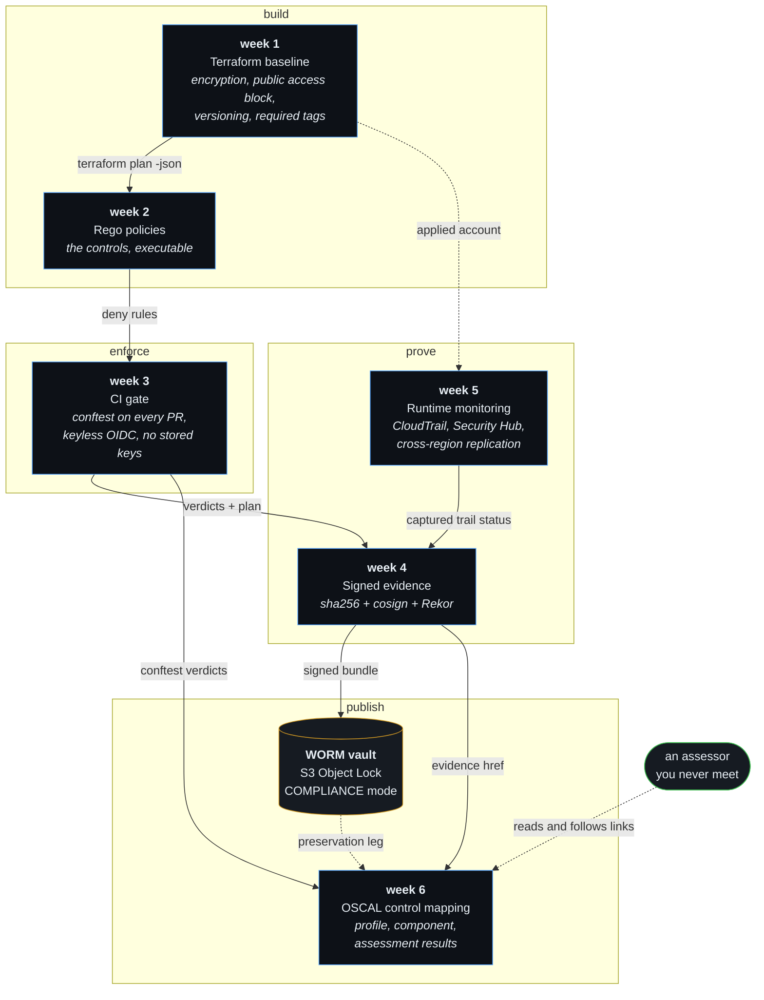

# Six weeks, one pipeline

A working AWS compliance pipeline, built a stage at a time. It provisions
infrastructure that satisfies NIST 800-53 controls, proves the controls with
policy-as-code, blocks pull requests that break them, signs the resulting
evidence, preserves it where nobody can delete it, watches the running account,
and publishes a control mapping an assessor can traverse without talking to
anyone.

Every claim on this page is checkable by running something. Start with:

```bash
./verify-pipeline.sh     # from the repo root — every eligibility check, one verdict
./traverse.sh            # profile -> component -> evidence -> CHAIN INTACT
```

## The pipeline



## The weeks

| Week | Builds | Proves | Front door |
|---|---|---|---|
| **1** | An S3 baseline in Terraform that satisfies five controls | That "compliant" can be a property of code rather than a claim in a spreadsheet | [week-1](week-1/) · [control mapping](week-1/compliance-mapping.md) |
| **2** | Rego policies that read a Terraform plan and deny violations | That a control can be executable, and that it *matches by reference, not by value* — the bucket's name is unknown at plan time | [week-2](week-2/) |
| **3** | A GitHub Actions gate that runs the policies on every pull request | That the control is enforced *before* a violation exists, not detected after | [week-3](week-3/) · [runbook](week-3/RUNBOOK.md) |
| **4** | Hashing, keyless cosign signing, Rekor timestamping, an Object Lock vault | That evidence can be intact, authentic, timely and undeletable — four separate properties, four separate mechanisms | [week-4](week-4/) · [WORM vs IAM](week-4/worm-vs-iam-preservation-deep-dive.md) |
| **5** | CloudTrail, Security Hub, cross-region replication, signed runtime evidence | That the *running* account can be observed, which is a different claim from what the plan intends | [week-5](week-5/) |
| **6** | OSCAL profile, component definition, assessment plan and results; a converter; the traversal | That a stranger can verify a control claim end to end from published artifacts | [week-6](week-6/) · [assessment results](week-6/assessment-results.md) |

## The full-pipeline control matrix

Every stage, for every control. Read a row left to right and you have the entire
chain of custody for one control — from the line of Terraform that implements it
to the OSCAL requirement an assessor reads.

| Control | Terraform resource | Rego rule | Gated on PR | Evidence | OSCAL |
|---|---|---|---|---|---|
| **SC-28**<br/>Protection of information at rest | `aws_s3_bucket_server_side_encryption_configuration`<br/>[week-1/solution/main.tf:46](week-1/solution/main.tf#L46) | `compliance.sc28_aws`<br/>[week-3/policies](week-3/policies/sc28_encryption_aws.rego) | ✅ plan-time | [week-4 signed bundle](week-4/evidence/evidence.tar.gz) + WORM vault | [`sc-28`](week-6/oscal/component-definitions/grc-pipeline/component-definition.json) |
| **AC-3**<br/>Access enforcement | `aws_s3_bucket_public_access_block`<br/>[week-1/solution/main.tf:90](week-1/solution/main.tf#L90) | `compliance.ac3_aws`<br/>[week-3/policies](week-3/policies/ac3_no_public_aws.rego) | ✅ plan-time | [week-4 signed bundle](week-4/evidence/evidence.tar.gz) + WORM vault | [`ac-3`](week-6/oscal/component-definitions/grc-pipeline/component-definition.json) |
| **CM-6**<br/>Configuration settings | provider `default_tags` + `aws_s3_bucket_versioning`<br/>[week-1/solution/main.tf:16,70](week-1/solution/main.tf#L16) | `compliance.cm6_aws`<br/>[week-3/policies](week-3/policies/cm6_required_tags_aws.rego) | ✅ plan-time | [week-4 signed bundle](week-4/evidence/evidence.tar.gz) + WORM vault | [`cm-6`](week-6/oscal/component-definitions/grc-pipeline/component-definition.json) |
| **AU-3**<br/>Content of audit records | `aws_cloudtrail.this`<br/>[week-5/terraform/cloudtrail.tf:51](week-5/terraform/cloudtrail.tf#L51) | — *none, deliberately* | ❌ runtime only | [week-5 signed bundle](week-5/evidence/week5-evidence.tar.gz) + WORM vault | [`au-3`](week-6/oscal/component-definitions/grc-pipeline/component-definition.json) |

The blank cell is the honest one. AU-3 has no plan-time rule because a plan can
show that a CloudTrail trail *will be created*; it cannot show that the trail is
*delivering records*, because delivery is a runtime property of a system that
does not exist yet. A rule for it would produce a green gate attesting to
nothing. Its evidence is captured `get-trail-status` output instead — a narrower
claim than the other three make, and a stronger one.

### Two mappings of AU-3, and why they differ

[Week 1's control mapping](week-1/compliance-mapping.md) assigns AU-3 to S3
server access logging. Week 6's OSCAL assigns it to CloudTrail. That is a
deliberate change, not a drift, and week 1's own document explains why: it flags
its AU-3 mapping as *"imprecise but assignment-intentional"*, noting that AU-3
governs the *fields inside an audit record*, which the service sets, and that
enabling capture is really AU-2 plus AU-12.

CloudTrail is the tighter fit. Its records carry the event type, time, source,
resource and outcome that AU-3 enumerates, and log-file validation adds an
hourly signed digest so a deleted log file is detectable rather than merely
absent. Week 1's mapping is left as written — rewriting it would erase the
reasoning that led here, and the week-1 evidence was captured against it.

## What this pipeline does not prove

Four things it would be easy to imply and dishonest to claim — plan-time is not
runtime, drift is mostly invisible, one signature is not a chain, and a one-day
Object Lock is a cost demo rather than a retention policy.

Written out in full: **[week-6/ASSURANCE-BOUNDARY.md](week-6/ASSURANCE-BOUNDARY.md)**.

## Verifying any of this yourself

Nothing here needs an AWS account or the author's cooperation.

```bash
# 1. The OSCAL documents are schema-valid
pip install compliance-trestle==4.2.0
cd 6week-challenge/week-6/oscal && trestle validate -a

# 2. The policy gate denies what it claims to deny
cd 6week-challenge/week-3
conftest test --all-namespaces -p policies plan.json         # passes
conftest test --all-namespaces -p policies plan-broken.json  # denies SC-28

# 3. The evidence is intact, authentic and timely
cd 6week-challenge/week-4 && ./verify-evidence.sh evidence/evidence.tar.gz

# 4. The whole graph, walked from the documents alone
cd ../.. && ./traverse.sh
```

The preservation leg of `verify-evidence.sh` reads Object Lock retention from a
private vault, so without AWS credentials it reports `skipped` rather than
passing. That is the intended behaviour: an unreadable vault is not a verified
vault. `./verify-pipeline.sh` works the same way — its two vault checks skip
without credentials, so the best outcome on any machine but the author's is
**12 passed, 1 skipped → `PIPELINE INCOMPLETE`**, never a pass that covers less
than it appears to.

### Portability is a requirement, not a hope

Every script targets **Linux and generalised bash**, not the machine it was
written on. That means bash 3.2 idioms where they cost nothing, `sha256sum` with
a `shasum` fallback, and jq filters that parse on 1.6 as well as 1.7.

It is verified by running, not asserted. This is the same
`./verify-pipeline.sh` inside a Debian 12 container:

```
#   image      Debian GNU/Linux 12 (bookworm) (aarch64)
#   bash       5.2.15(1)-release    jq  jq-1.6    coreutils  GNU 9.1
...
12 passed, 0 failed, 1 skipped
```

Full transcript:
[`week-6/evidence/pipeline-verification-linux.txt`](week-6/evidence/pipeline-verification-linux.txt).

Running it there was not a formality — it caught two bugs that macOS hid,
including one that reported success while verifying nothing. See the commit log.
