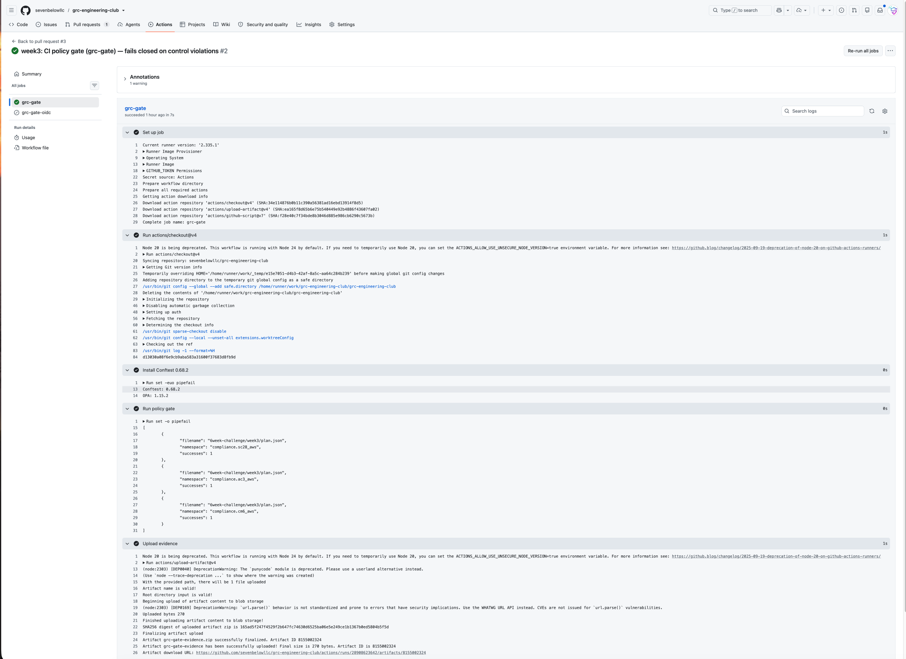
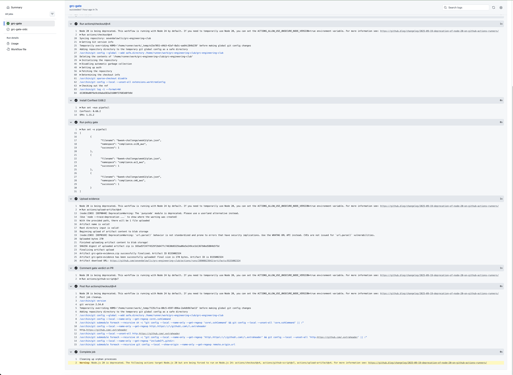
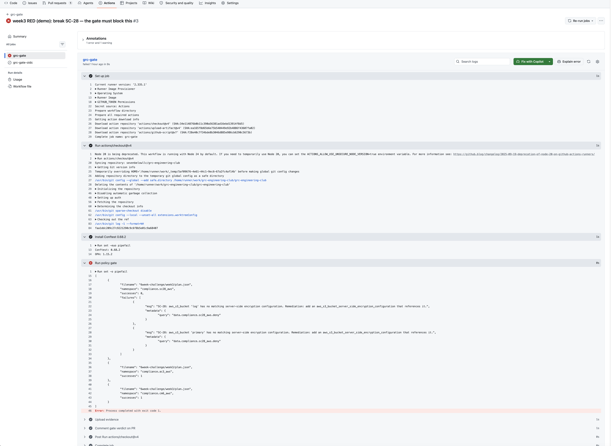
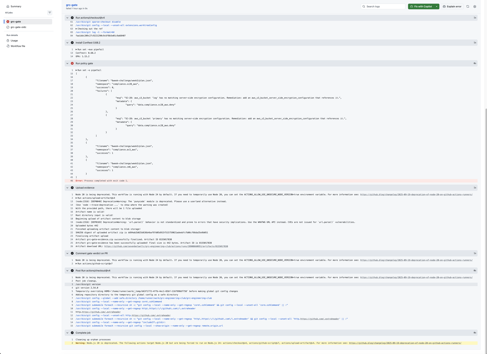
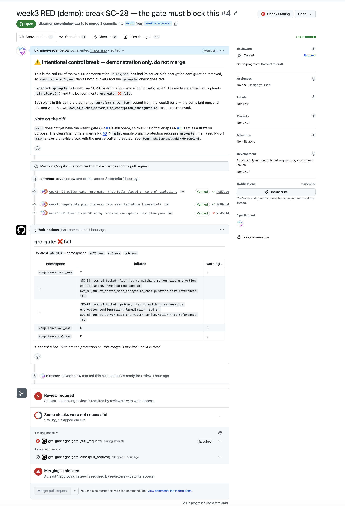
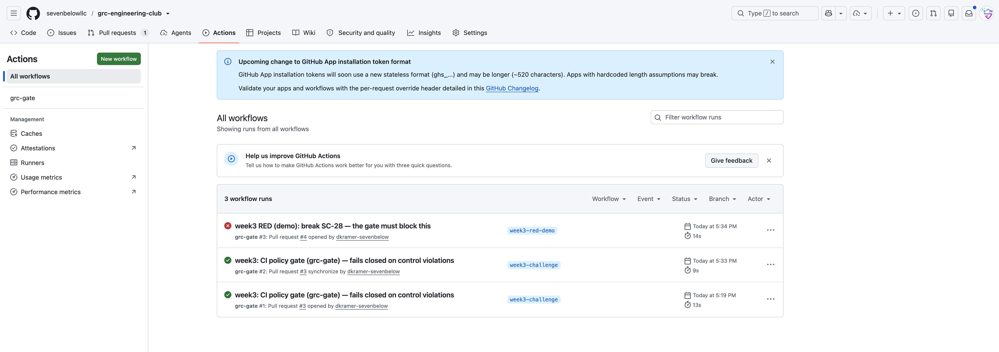

# Week 3 Submission — Build the Gate

## Writeup

Week 2 made the rules executable: three Rego policies that read a Terraform plan
and return a verdict on SC-28, AC-3, and CM-6. But a policy you run on your laptop
only catches *your* mistakes, when you remember to run it. Week 3 moves that check
to where it can't be skipped — a **GitHub Actions gate that runs on every pull
request to `main` and blocks the ones that break a control.**

This moves compliance out of human review entirely: no one has to remember to
check a change for encryption, because the pipeline decides in seconds and only
escalates to a person when a control genuinely fails.

The gate — [`.github/workflows/grc-gate.yml`](../../.github/workflows/grc-gate.yml) —
does four things on every PR:

1. Installs **Conftest `v0.68.2`** (pinned — a moving `latest` is not reproducible
   evidence).
2. Runs the three namespaces (`compliance.sc28_aws`, `compliance.ac3_aws`,
   `compliance.cm6_aws`) against the committed [`plan.json`](./plan.json).
3. Writes the machine-readable result to `evidence/conftest-results.json` and
   **fails the job** on any violation.
4. Uploads `evidence/` as a build artifact — **even when the gate fails.**

A repository ruleset (`grc-gate-required`) then makes the `grc-gate` check
**required** on `main`, so a PR that breaks a control cannot merge until it is fixed.

## The one technique: fail closed without losing the evidence

The natural mistake is a trap you can fall into two ways at once. Conftest exits
non-zero on a violation *and* prints its report to stdout. If you redirect that
output to a file to capture evidence, you swallow the exit code — and now the gate
records the violation but still passes the build. A gate that captures violations
but goes green is not a gate. But if you let the failure abort the job before the
upload runs, you lose the evidence — which is the whole reason to capture it in CI.

Both are solved by one line:

```bash
set -o pipefail
conftest test plan.json --policy policies \
  --namespace compliance.sc28_aws \
  --namespace compliance.ac3_aws \
  --namespace compliance.cm6_aws \
  --output json | tee evidence/conftest-results.json
```

`tee` writes the JSON report to the evidence file as it streams. `set -o pipefail`
makes the pipeline exit with Conftest's non-zero status *after* `tee` has already
written the file. One run, one source of truth: the evidence is saved **and** the
job fails closed. The upload step is then marked `if: always()` so it runs whether
the gate passed or failed.

## Proof: the two-PR demonstration

Two pull requests, both gated by the same workflow, both using **authentic
`terraform show -json` output** from the week-3 build — one compliant, one with the
two `aws_s3_bucket_server_side_encryption_configuration` resources removed.

### Green PR — every control passes ([PR #3](https://github.com/sevenbelowllc/grc-engineering-club/pull/3))

The gate installs Conftest, runs all three namespaces against the compliant plan,
and every namespace reports `"successes": 1`. The check goes green and the PR is
mergeable. Evidence artifact `grc-gate-evidence` (270 bytes) is attached.





### Red PR — SC-28 fails, the merge is blocked ([PR #4](https://github.com/sevenbelowllc/grc-engineering-club/pull/4))

`plan.json` has its encryption configuration removed, so `compliance.sc28_aws`
denies both buckets by name. The gate step exits with code 1 and the job fails.



Crucially, the evidence still uploads on failure (442 bytes) — `if: always()` doing
its job. That failure record is the point of CI evidence.



With the `grc-gate` check required by branch protection, the red PR **cannot be
merged.** The bot posts the verdict, the required check shows failing, and the merge
button is disabled — "Merging is blocked."



Both runs are visible in the Actions tab — the red demo and the two green runs.



## Stretch: keyless plan generation via GitHub OIDC

The committed-plan path is the simple, free, no-secrets deliverable. The production
version does not commit a plan — CI generates it by assuming a **read-only AWS role
through GitHub OIDC**, with no stored keys, bound to
`repo:sevenbelowllc/grc-engineering-club:*` and nothing looser. It ships as a dormant
second job (`grc-gate-oidc`) plus the IAM Terraform to enable it; the job stays
skipped until `AWS_GATE_ROLE_ARN` is set, so it never breaks the main path. See
[`oidc/README-oidc.md`](./oidc/README-oidc.md).

## What the gate enforces

| Namespace | Control | Denies |
| --- | --- | --- |
| `compliance.sc28_aws` | **SC-28** Encryption at Rest | any `aws_s3_bucket` with no matching server-side encryption configuration |
| `compliance.ac3_aws` | **AC-3** Access Enforcement | any `aws_s3_bucket` whose public access block is missing or has any of its four flags not `true` |
| `compliance.cm6_aws` | **CM-6** Configuration Settings | any taggable resource missing one of the four required tags |

## Evidence index

| Artifact | What it proves |
| --- | --- |
| [`.github/workflows/grc-gate.yml`](../../.github/workflows/grc-gate.yml) | The gate — the deliverable itself |
| [PR #3](https://github.com/sevenbelowllc/grc-engineering-club/pull/3) (green) | Compliant plan passes; PR mergeable |
| [PR #4](https://github.com/sevenbelowllc/grc-engineering-club/pull/4) (red) | Broken plan fails SC-28; merge blocked |
| `evidence/GRCChallenge-week3-grcgate-pass-p1.png` / `-p2.png` | Green run — all three namespaces pass, evidence uploaded |
| `evidence/GRCChallenge-week3-grcgate-fail-p1.png` / `-p2.png` | Red run — SC-28 fails, exit 1, evidence still uploaded |
| `evidence/GRCChallenge-week3-failure-evidence.png` | Red verdict + required check failing + merge blocked |
| `evidence/GRCChallenge-week3-grcgate-full-report.png` | Actions history — one red, two green |
| [`plan.json`](./plan.json) / [`plan-broken.json`](./plan-broken.json) | Authentic terraform plans — compliant and encryption-removed |
| Ruleset `grc-gate-required` | Branch protection requiring `grc-gate` on `main` |

## Done when — checklist

- [x] A PR triggers the workflow and it appears in the Actions tab
- [x] The compliant PR ends green
- [x] The violating PR ends red and is blocked by branch protection
- [x] An evidence artifact is attached to both runs
- [x] README section explains what the gate enforces and what breaking a control does
- [ ] Both checks posted to LinkedIn (green + red), tagging GRC Engineering Club with `#GRCEngClubChallenge`
